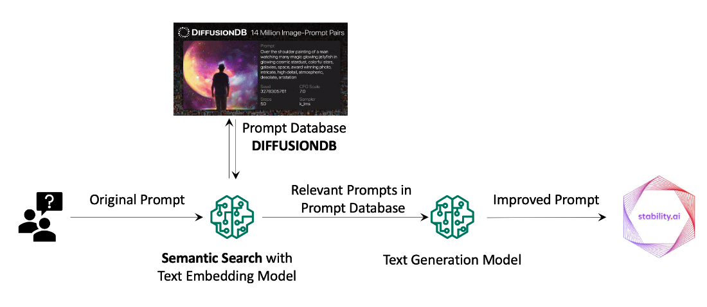

# Stable-Diffusion-Prompt-RAG


This is a demo of improving Stable Diffusion prompts with Retrieval-Augmented Generation (RAG) using Amazon Bedrock models:
- Text Generation: [Claude V2](https://aws.amazon.com/bedrock/claude/) "anthropic.claude-v2"
- Text Embedding: [Titan embedding](https://aws.amazon.com/bedrock/titan/) "amazon.titan-embed-text-v1"
- Image Generation: [Stable Diffusion XL](https://aws.amazon.com/bedrock/stable-diffusion/) "stability.stable-diffusion-xl-v0"
- Vector Database: FAISS
- Prompt Database: a subset from [DiffusionDB](https://huggingface.co/datasets/poloclub/diffusiondb) on Hugging Face

### 1. Download this git repo into your Sagemaker Studio

Open a terminal on SageMaker Studio. You will be running all the subsequnt commands on the terminal window. Start by cloning this repo onto the SageMaker Studio. 
```
> git clone https://github.com/aws-samples/name-of-the-repo.git
```

### 2. Enable AWS IAM permissions for Bedrock

The AWS identity you assume from your notebook environment must have sufficient AWS IAM permissions to call the Amazon Bedrock service. It is the [Studio/notebook Execution Role](https://docs.aws.amazon.com/sagemaker/latest/dg/sagemaker-roles.html) from SageMaker, or could be a role or IAM User for self-managed notebooks.

To grant Bedrock access to your identity, you can:

- Open the [AWS IAM Console](https://us-east-1.console.aws.amazon.com/iam/home?#)
- Find your [Role](https://us-east-1.console.aws.amazon.com/iamv2/home?#/roles) if using SageMaker or otherwise assuming an IAM Role.
- Select Add Permissions > Create Inline Policy to attach new inline permissions, open the JSON editor and paste in the below example policy:

```
{
    "Version": "2012-10-17",
    "Statement": [
        {
            "Sid": "BedrockFullAccess",
            "Effect": "Allow",
            "Action": ["bedrock:*"],
            "Resource": "*"
        }
    ]
}
```

### 3. Configure environment variables using the command blueprints below

Before running the command, look up endpoint URL from [Amazon Bedrock Doc](https://docs.aws.amazon.com/general/latest/gr/bedrock.html). Choose the endpoint in the region of your choice. The following shows URL for the Oregon (us-west-2) region.

If you choose to use AWS Profile, specify the profile name. If you were running the app from SageMaker Studio, you can skip it.
```
export AWS_ENDPOINT_URL=https://bedrock-runtime.us-west-2.amazonaws.com
export AWS_REGION_NAME=us-west-2
export AWS_PROFILE_NAME=IF_YOU_NEED_TO_USE_AN_AWS_CLI_PROFILE_IT_GOES_HERE
```

Run the following commands to confirm that your environment variables are set properly:
```
echo $AWS_ENDPOINT_URL
echo $AWS_REGION_NAME
echo $AWS_PROFILE_NAME
```
### 4. Install the required python libraries

This step installs all the neccessary Python libraires for the subsequent code to run. 

Here is the list of libraries:

- datasets[s3]==2.13.0
- Levenshtein
- streamlit==1.26.0
- boto3>=1.28.57
- awscli>=1.29.57
- botocore>=1.31.57
- langchain>=0.0.304
- faiss-cpu>=1.7,<2
- pypdf>=3.8,<4
- sqlalchemy

```
pip install -r requirements.txt
```

### 5. Prepare the dataset of 1K prompt examples from DiffusionDB

This step downloads and prepares the dataset from [HugginFace](https://huggingface.co/datasets/poloclub/diffusiondb/resolve/main/metadata.parquet). When the execution completes, it creates a CSV file called, <i>prompts_unique.csv</i>. 

Note: This step will take about 1-2 mins to complete. 

```
> python imgrag_prep.py
```

### 6. Run the application

Once the data is ready, it is time to build the app. By running the following, you will convert the prepared dataset/prompts to embeddings, and build a FAISS in-memory vector store for semantic search.  

Note: This step will take about 1-2 mins to complete.

```
> streamlit run imgrag_app.py --server.port 8080
```
When the application is up and running, it will return Network URL and Externail URL but we will not use either. Instead, follow the instruction [here](https://aws.amazon.com/blogs/machine-learning/build-streamlit-apps-in-amazon-sagemaker-studio/) to access the Streamlit application. 

In a nutshell, you will use your Studio URL, replacing <code>lab?</code> with <code>proxy/[PORT NUMBER]/</code>

```
https://YOUR_UNIQUE_ID.studio.us-west-2.sagemaker.aws/jupyter/default/proxy/8080/
```

Once the app is full loaded and ready, enter a text to the prompt improvement to test it. 


I got a list of enhanced prompts. I chose one of them, and copy & paste it to Image Generation. 


### 7. Cleanup

After you tried the app, stop the application to avoid any unneccessary cost. 